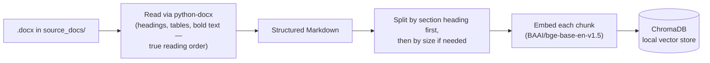
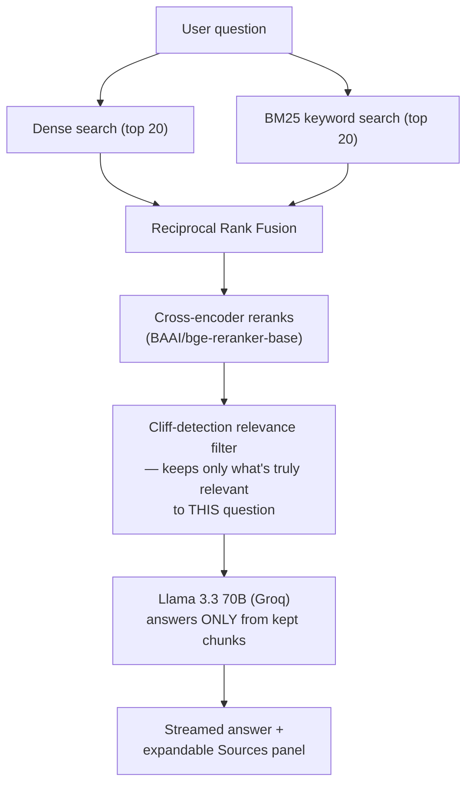

<div align="center">


# PhotonX Copilot

**Ask anything about PhotonX — answered straight from the source, never from a guess.**

A Retrieval-Augmented Generation (RAG) chatbot that answers questions using
*only* PhotonX's own company documents — with per-question source
citations you can actually inspect.

[](https://photonxrag.streamlit.app/)
[](https://www.python.org/)
[](https://streamlit.io/)
[](https://groq.com/)

[**🚀 Try it live**](https://photonxrag.streamlit.app/) · [How it works](#-how-it-works) · [Setup](#-getting-started) · [Tech stack](#-tech-stack--why)

</div>

---

## 📌 Overview

PhotonX Copilot is a **grounded** Q&A assistant — it never answers from the
model's general knowledge. Every response is built exclusively from
relevant passages retrieved from PhotonX's internal `.docx` documentation,
and every answer comes with an inspectable **"Sources"** panel showing the
exact excerpts it was built from.

No fixed source count, no guessed thresholds — the number of sources shown
adapts per question, based on how much of the document is genuinely
relevant to what was asked.

---

## ✨ Features

- 🔍 **Hybrid search** — combines meaning-based (dense) search with
  keyword (BM25) search, so both paraphrased and exact-term questions work
- 🎯 **Cross-encoder reranking** — a dedicated relevance model double-checks
  every candidate before it's allowed into the answer
- 📎 **Honest, dynamic citations** — shows *only* genuinely relevant
  sources (1 for a narrow question, several for a broad one), each
  expandable to the real excerpt it came from
- ⚡ **Streamed responses** — answers appear token-by-token via Groq's
  Llama 3.3 70B
- 📄 **Structure-aware document ingestion** — reads `.docx` headings,
  tables, and formatting in true reading order, not a flat text dump
- 🔄 **Incremental indexing** — only re-embeds documents that actually
  changed since the last run

---

## 🧠 How It Works

### Phase 1 — Ingestion *(run once, whenever the source document changes)*



### Phase 2 — Answering *(runs on every question)*



The relevance filter is the detail worth knowing: instead of always
showing a fixed number of sources, it looks at *this question's own*
ranked score list and cuts where there's a genuine drop-off in relevance —
so a narrow question can return one clean source, and a broad one can
return several, without ever needing a hand-tuned magic number.

---

## 🛠 Tech Stack — & Why

| Layer | Tool | Why this one |
|---|---|---|
| UI | **Streamlit** | Full chat interface in pure Python — no separate frontend to maintain |
| Document parsing | **python-docx** | Preserves real document structure (headings, tables, bold text) instead of a flat text dump |
| Chunking | **LangChain text splitters** | Splits by heading first to keep related content together, falls back to size-based splitting only when needed |
| Vector store | **ChromaDB** | Local, persistent, zero external infra |
| Dense embeddings | **BAAI/bge-base-en-v1.5** | Strong open-source semantic search model |
| Keyword search | **BM25** (`rank_bm25`) | Catches exact terms/names dense search alone can miss |
| Result fusion | **Reciprocal Rank Fusion** | Merges two ranked lists fairly without comparing incompatible raw scores |
| Reranking | **BAAI/bge-reranker-base** | Reads query + chunk *together* — far more accurate relevance judgment than search alone |
| Answer generation | **Llama 3.3 70B via Groq** | Fast, free-tier-friendly, streamable |

---

## 📂 Project Structure

```
PhotonXRAG/
├── app.py              # Streamlit UI — chat, styling, source display
├── ingest.py            # Document ingestion pipeline (run when source docs change)
├── rag_engine.py         # Retrieval, fusion, reranking, relevance filtering, LLM calls
├── requirements.txt
├── assets/
│   └── photonx-logo.png
├── source_docs/
│   └── source_docs.docx  # Drop your .docx files here to index them
└── chroma_db/            # Generated — persisted vector index (not committed)
```

---

## 🚀 Getting Started

### 1. Clone & install

```bash
git clone https://github.com/<your-username>/PhotonXRAG.git
cd PhotonXRAG
pip install -r requirements.txt
```

### 2. Set your Groq API key

```bash
export GROQ_API_KEY=your_key_here
```

Or add it to `.streamlit/secrets.toml`:

```toml
GROQ_API_KEY = "your_key_here"
```

### 3. Add your source document(s)

Drop any `.docx` file into `source_docs/`, then build the index:

```bash
python ingest.py
```

Re-run this any time a source document changes — it only re-processes
files that actually changed.

### 4. Run the app

```bash
streamlit run app.py
```

---

## 🌐 Live Demo

**[photonxrag.streamlit.app →](https://photonxrag.streamlit.app/)**

---

## 🗺 Roadmap Ideas

- [ ] Support multiple source documents with per-document filtering
- [ ] Conversation export
- [ ] Configurable relevance sensitivity from the UI

---

## 📄 License

Add your preferred license (e.g. MIT) as a `LICENSE` file in the repo root.

---

<div align="center">

Built with Streamlit, ChromaDB, and Groq.

</div>
